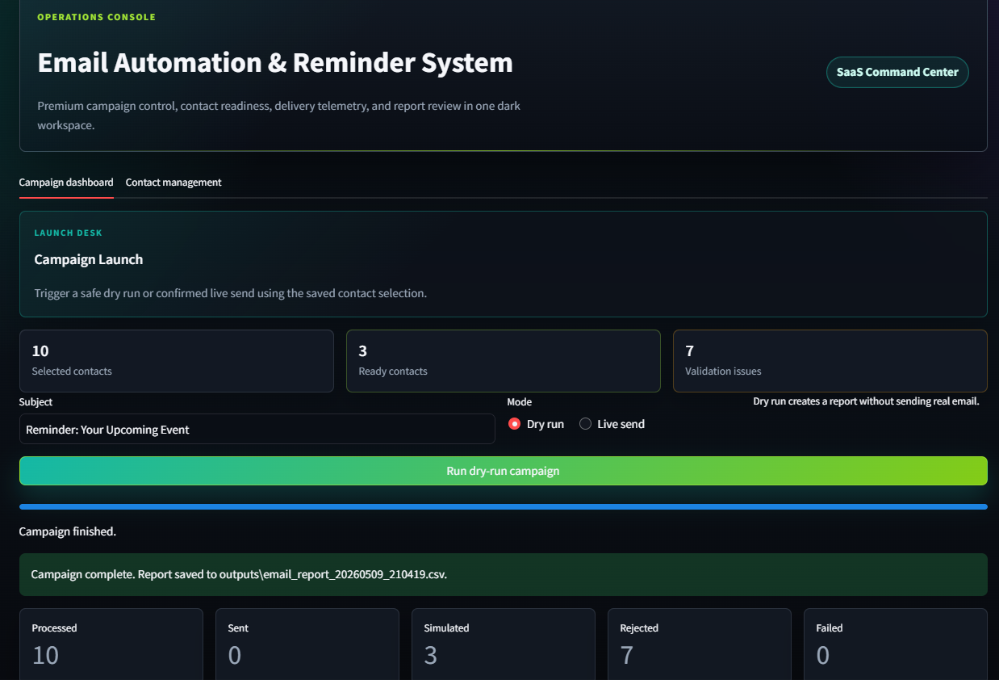
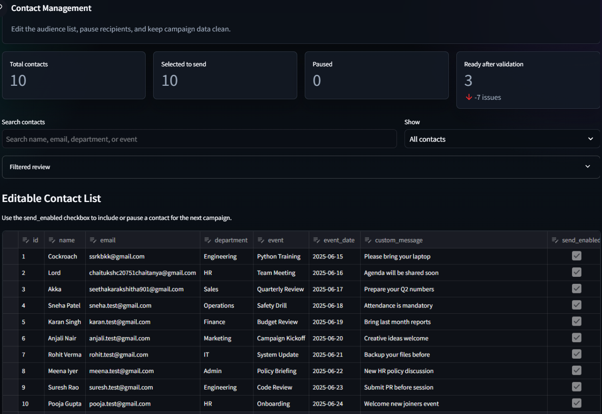
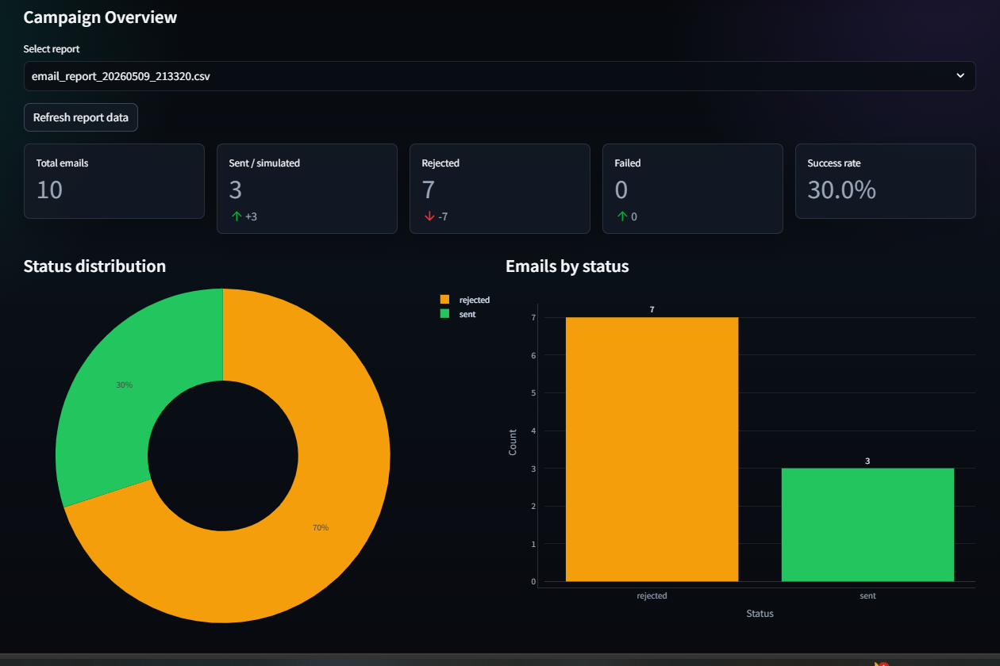
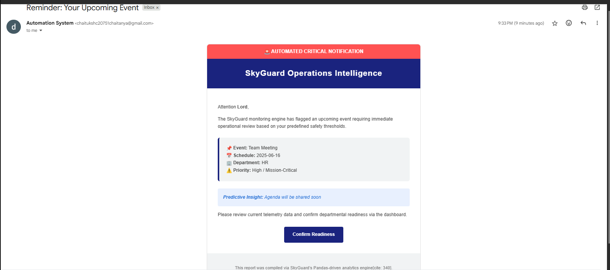

<div align="center">


<br/><br/>

# 📧 Email Automation & Reminder System

### Enterprise-style email operations platform with Streamlit dashboarding, SMTP automation, contact governance, reporting pipelines, and template-driven campaign orchestration

[](LICENSE)
[]()
[]()
[]()
[]()
[]()

<br/>

</div>

---

## 📌 Table of Contents

- [Overview](#overview)
- [Problem Statement](#problem-statement)
- [Core Features](#core-features)
- [Industry Relevance](#industry-relevance)
- [System Architecture](#system-architecture)
- [Operational Workflow](#operational-workflow)
- [Tech Stack](#tech-stack)
- [Data Schema](#data-schema)
- [Template & Delivery Engine](#template--delivery-engine)
- [Dashboard Layer](#dashboard-layer)
- [Project Structure](#project-structure)
- [Installation](#installation)
- [How to Run](#how-to-run)
- [Dashboard Overview](#dashboard-overview)
- [Screenshots & Outputs](#screenshots--outputs)
- [Verification Performed](#verification-performed)
- [Security & Safety](#security--safety)
- [Learning Outcomes](#learning-outcomes)
- [Future Improvements](#future-improvements)
- [License](#license)

---

<a id="overview"></a>

## 🔍 Overview

The **Email Automation & Reminder System** is an enterprise-style Python automation platform designed to streamline operational email workflows through centralized campaign orchestration, contact governance, SMTP automation, reporting pipelines, and dashboard-driven monitoring.

The project simulates the architecture and workflow of internal notification systems commonly used in:

- HR onboarding automation
- Corporate training reminders
- Compliance notifications
- Internal operations messaging
- Event communication workflows
- Customer reminder pipelines

The platform combines:

- **Streamlit operational dashboarding**
- **SMTP email automation**
- **Jinja2-based dynamic templating**
- **CSV-driven contact pipelines**
- **Safe dry-run campaign simulation**
- **Campaign reporting & status tracking**
- **Email validation & governance**
- **Environment-secured credential management**

Unlike basic bulk-mail scripts, the system introduces controlled delivery workflows, operational safety layers, recipient governance, reporting visibility, and recruiter-grade engineering structure.

---

<a id="problem-statement"></a>

## ❗ Problem Statement

Organizations frequently send repetitive operational emails for onboarding, meetings, compliance, trainings, policy updates, and internal communication campaigns.

Manual handling introduces several operational challenges:

- **Repeated Manual Work**  
  Teams repeatedly compose and send nearly identical reminder emails.

- **No Delivery Governance**  
  Organizations struggle to control which recipients should or should not receive operational campaigns.

- **No Validation Pipeline**  
  Dummy, invalid, or test email addresses can accidentally enter production workflows.

- **Lack of Operational Visibility**  
  Manual workflows rarely provide campaign logs, structured reporting, or status auditing.

- **Unsafe Bulk Sending**  
  Many lightweight automation scripts immediately trigger SMTP delivery without simulation or validation.

- **No Dashboard Control Layer**  
  Traditional scripts lack centralized operational management interfaces.

This project addresses those challenges by combining automation, governance, reporting, validation, and dashboard orchestration into a single operational workflow.

---

<a id="core-features"></a>

## 🚀 Core Features

### Operational Dashboard

- Premium dark Streamlit dashboard UI
- Campaign orchestration controls
- Contact management workspace
- Campaign monitoring tables
- Status visualization and reporting
- Live operational metrics display

### Campaign Automation

- SMTP-based email delivery
- Safe dry-run campaign simulation
- Live-send execution workflow
- Recipient-level campaign filtering
- Environment-driven delivery configuration

### Contact Governance

- Add/edit/remove recipient records
- Pause or disable recipients
- `send_enabled` recipient control flag
- CSV-based contact persistence
- Email validation enforcement

### Template Engine

- Personalized Jinja2 HTML templates
- Plain-text fallback email templates
- Dynamic event insertion
- Custom recipient messaging

### Reporting & Monitoring

- Timestamped CSV campaign reports
- Email delivery status tracking
- Persistent email activity logging
- Failed/rejected delivery visibility
- Delivery audit pipeline

### Validation & Safety

- Dummy/test email rejection
- Dry-run before live delivery
- Gmail App Password support
- `.env` credential isolation
- Campaign confirmation controls

---

<a id="industry-relevance"></a>

## 🏭 Industry Relevance

| Industry                    | Operational Use Case               | Equivalent Enterprise Workflow |
| --------------------------- | ---------------------------------- | ------------------------------ |
| **Human Resources**         | Employee onboarding reminders      | HR automation platforms        |
| **Corporate Training**      | Certification & workshop reminders | LMS notification systems       |
| **Operations Management**   | Internal communication campaigns   | Enterprise messaging pipelines |
| **Education**               | Student reminder workflows         | Academic notification systems  |
| **Customer Success**        | Reminder and engagement emails     | CRM campaign automation        |
| **Compliance & Governance** | Policy renewal notifications       | Corporate compliance systems   |
| **Event Management**        | RSVP and schedule reminders        | Event communication platforms  |

The operational workflow mirrors modern communication automation systems:

```text
CSV Contacts → Validation → Template Rendering → SMTP Automation → Reporting → Dashboard Monitoring
```

---

<a id="system-architecture"></a>

## 🏗️ System Architecture

```text
+--------------------------------------------------------------+
|                     INPUT LAYER                              |
|             contacts.csv + reminders.csv                     |
+------------------------------+-------------------------------+
                               |
                               v
+--------------------------------------------------------------+
|                  CONTACT GOVERNANCE ENGINE                   |
| * Contact Filtering       * Recipient Selection              |
| * Email Validation        * send_enabled Enforcement         |
+------------------------------+-------------------------------+
                               |
                               v
+--------------------------------------------------------------+
|                  TEMPLATE & DELIVERY ENGINE                  |
| * Jinja2 HTML Rendering   * Plain-text Rendering             |
| * Dry-run Simulation      * SMTP Delivery Pipeline           |
+------------------------------+-------------------------------+
                               |
                               v
+--------------------------------------------------------------+
|                STATUS TRACKING & REPORTING                   |
| * CSV Report Generation   * Campaign Logging                 |
| * Delivery Statuses       * Failure Visibility               |
+------------------------------+-------------------------------+
                               |
                               v
+--------------------------------------------------------------+
|                    DASHBOARD LAYER                           |
| * Streamlit Operations UI * Campaign Controls                |
| * Monitoring Tables       * Reporting Visualization          |
+--------------------------------------------------------------+
```

---

<a id="operational-workflow"></a>

## ⚙️ Operational Workflow

```text
1. Load Contacts from CSV
           ↓
2. Validate Email Addresses
           ↓
3. Filter send_enabled Recipients
           ↓
4. Render Personalized Templates
           ↓
5. Execute Dry-Run Simulation
           ↓
6. Review Logs & Reports
           ↓
7. Trigger Live SMTP Delivery
           ↓
8. Generate Campaign Reports
           ↓
9. Monitor Results in Dashboard
```

---

<a id="tech-stack"></a>

## 🛠️ Tech Stack

| Component        | Technology     | Purpose                                        |
| ---------------- | -------------- | ---------------------------------------------- |
| Backend Engine   | Python 3.10+   | Core orchestration and workflow execution      |
| Dashboard UI     | Streamlit      | Operational monitoring and campaign management |
| Data Processing  | Pandas         | CSV ingestion and transformation               |
| Email Templating | Jinja2         | Dynamic HTML/text rendering                    |
| Email Delivery   | SMTP           | Live campaign delivery                         |
| Configuration    | python-dotenv  | Environment-based credential handling          |
| Logging          | Python Logging | Campaign audit trails                          |
| Reporting        | CSV Generation | Structured operational reporting               |

---

<a id="data-schema"></a>

## 🗄️ Data Schema

### `contacts.csv`

```text
id, name, email, department, event, event_date,
custom_message, send_enabled
```

### Sample Contact Record

```csv
1,Alex Carter,alex@example.com,Engineering,Python Training,2025-06-15,Please bring your laptop,True
```

### `reminders.csv`

```text
reminder_id, contact_id, reminder_type, send_time, status
```

### Sample Reminder Record

```csv
R001,1,Training Reminder,09:00,pending
```

### Contact Governance Rules

| Field                | Purpose                          |
| -------------------- | -------------------------------- |
| `send_enabled=True`  | Recipient included in campaign   |
| `send_enabled=False` | Recipient excluded from delivery |
| Invalid email        | Automatically rejected           |
| Dummy/test domain    | Blocked before SMTP stage        |

---

<a id="template--delivery-engine"></a>

## 🧠 Template & Delivery Engine

### Personalized Email Rendering

The platform uses Jinja2 templates to dynamically generate personalized HTML and plain-text emails.

Dynamic variables include:

- Recipient name
- Event title
- Event date
- Department
- Custom messages

### Delivery Pipeline

The email delivery workflow supports two operational modes:

| Mode        | Description                                  |
| ----------- | -------------------------------------------- |
| `Dry-Run`   | Simulates delivery without SMTP transmission |
| `Live Send` | Executes real SMTP delivery                  |

### Email Validation Rules

The system proactively rejects unsafe or dummy addresses.

| Validation Rule | Example                   | Result   |
| --------------- | ------------------------- | -------- |
| Valid structure | `user@gmail.com`          | Accepted |
| `.test` keyword | `user.test@gmail.com`     | Rejected |
| Dummy domains   | `user@example.com`        | Rejected |
| Fake keywords   | `dummy`, `sample`, `demo` | Rejected |

### Status Tracking

Every processed email is categorized into structured statuses:

| Status      | Meaning                   |
| ----------- | ------------------------- |
| `simulated` | Processed in dry-run mode |
| `sent`      | SMTP delivery successful  |
| `rejected`  | Blocked by validation     |
| `failed`    | SMTP/runtime failure      |

---

<a id="dashboard-layer"></a>

## 📊 Dashboard Layer

The Streamlit dashboard acts as a centralized operations console for campaign execution and monitoring.

### Campaign Dashboard

- Run dry-run campaigns
- Trigger live SMTP sends
- View campaign statistics
- Inspect status tables
- Analyze generated reports
- Monitor email activity logs

### Contact Management Workspace

- Add/edit recipient records
- Enable/disable recipients
- Validate recipient datasets
- Export updated CSV records
- Maintain delivery governance

### Operational UI Design

- Dark SaaS-inspired interface
- Operational monitoring layout
- Recruiter-grade visual hierarchy
- Dashboard-driven workflow orchestration

---

<a id="project-structure"></a>

## 📁 Project Structure

```text
Email-Automation-Reminder-System/
|
|-- dashboard.py
|-- main.py
|-- requirements.txt
|-- README.md
|-- LICENSE
|-- .env.example
|
|-- data/
|   |-- contacts.csv
|   `-- reminders.csv
|
|-- templates/
|   |-- reminder_template.html
|   `-- reminder_template.txt
|
|-- src/
|   |-- contact_reader.py
|   |-- email_sender.py
|   |-- report_generator.py
|   |-- scheduler.py
|   |-- status_tracker.py
|   `-- template_engine.py
|
|-- outputs/
|   `-- email_report_YYYYMMDD_HHMMSS.csv
|
|-- logs/
|   `-- email_log.txt
|
`-- screenshots/
    |-- dashboard.png
    |-- contacts.png
    `-- reports.png
```

---

<a id="installation"></a>

## ⚙️ Installation

### Step 1 — Clone Repository

```powershell
git clone https://github.com/CH-S-K-CHAITANYA/Email-Automation-Reminder-System.git
cd Email-Automation-Reminder-System
```

### Step 2 — Create Virtual Environment

```powershell
python -m venv .venv
.\.venv\Scripts\activate
```

### Step 3 — Install Dependencies

```powershell
pip install -r requirements.txt
```

### Step 4 — Configure Environment Variables

Copy `.env.example` into `.env`

```powershell
copy .env.example .env
```

Configure SMTP credentials:

```env
SENDER_EMAIL=your_email@gmail.com
SENDER_PASSWORD=your_gmail_app_password
SMTP_HOST=smtp.gmail.com
SMTP_PORT=587
DRY_RUN=True
```

### Gmail SMTP Requirements

- Enable 2-Step Verification
- Generate a Gmail App Password
- Use App Password instead of your main Gmail password

---

<a id="how-to-run"></a>

## ▶️ How to Run

### Launch Streamlit Dashboard

```powershell
streamlit run dashboard.py
```

### Run Local CLI Workflow

```powershell
python main.py
```

### Execute Live SMTP Campaign

```powershell
python main.py --live
```

---

<a id="dashboard-overview"></a>

## 🖥️ Dashboard Overview

### Campaign Operations Console

The dashboard provides centralized operational control for campaign execution.

Capabilities include:

- Recipient campaign filtering
- Live-send confirmation workflow
- Dry-run campaign simulation
- Delivery status inspection
- CSV report visibility
- Operational log review

### Contact Governance Workspace

Operational teams can:

- Add new recipients
- Pause recipients
- Enable/disable campaign eligibility
- Maintain CSV datasets
- Prevent accidental delivery exposure

---

<a id="screenshots--outputs"></a>

## 🖼️ Screenshots & Outputs

<div align="center">

### Dashboard Interface



<br/><br/>

### Contact Management Workspace



<br/><br/>

### Campaign Reports & Status Tracking



</div>

### Mail Recieved By Customer



</div>

---

<a id="verification-performed"></a>

## ✅ Verification Performed

- Python modules validated successfully
- SMTP simulation pipeline tested
- CSV ingestion workflow verified
- Jinja2 template rendering validated
- Streamlit dashboard launched successfully
- Dry-run campaign reports generated
- Logging pipeline confirmed operational
- Invalid email rejection workflow verified
- Recipient filtering tested with `send_enabled`
- CLI and dashboard workflows validated

---

<a id="security--safety"></a>

## 🔐 Security & Safety

### Operational Safety Controls

- Dry-run enabled before production delivery
- SMTP credentials isolated via `.env`
- Recipient governance enforcement
- Dummy/test email rejection
- Delivery confirmation workflow
- Persistent operational logging

### Recommended Best Practices

- Never commit `.env` files
- Use Gmail App Passwords only
- Validate recipient lists before live campaigns
- Review generated reports before reruns
- Keep operational logs for audit visibility

---

<a id="learning-outcomes"></a>

## 🎓 Learning Outcomes

### Backend Engineering

- Python modular architecture
- SMTP automation workflows
- Environment-driven configuration
- Operational logging systems

### Data Processing

- CSV ingestion pipelines
- Pandas transformation workflows
- Recipient filtering logic
- Reporting generation

### Dashboard Engineering

- Streamlit operational dashboarding
- Interactive management workflows
- Operational UI structuring
- Monitoring interface design

### Software Architecture

- Separation of concerns
- Workflow orchestration
- Template-driven automation
- Service-oriented modular design

### Automation Engineering

- Email campaign lifecycle management
- Validation and governance pipelines
- Delivery safety controls
- Operational workflow automation

---

<a id="future-improvements"></a>

## 🔮 Future Improvements

- [ ] Scheduled cron-based campaign execution
- [ ] PostgreSQL recipient persistence
- [ ] Multi-user authentication system
- [ ] Email open/click tracking analytics
- [ ] Celery/RabbitMQ background workers
- [ ] Docker containerization
- [ ] FastAPI REST service layer
- [ ] Attachment delivery support
- [ ] Campaign analytics dashboard
- [ ] Multi-provider SMTP failover
- [ ] Role-based operational access
- [ ] Bulk campaign segmentation engine

---

<a id="license"></a>

## 📄 License

This project is licensed under the
[Creative Commons Attribution-NonCommercial 4.0 International License](LICENSE).

Commercial usage, SaaS redistribution,
monetization, or proprietary deployment
is prohibited without explicit written permission
from the author.

Full License:
https://creativecommons.org/licenses/by-nc/4.0/

---

<div align="center">

## 👨‍💻 Author

### **CH S K CHAITANYA**

[](https://linkedin.com/in/chskaitanya)

[](https://github.com/CH-S-K-CHAITANYA)

[](https://github.com/CH-S-K-CHAITANYA/Email-Automation-Reminder-System)

<br/>

⭐ If you found this project useful, consider starring the repository.

</div>
